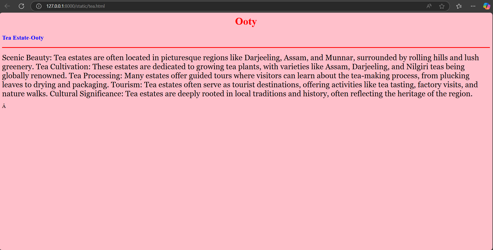
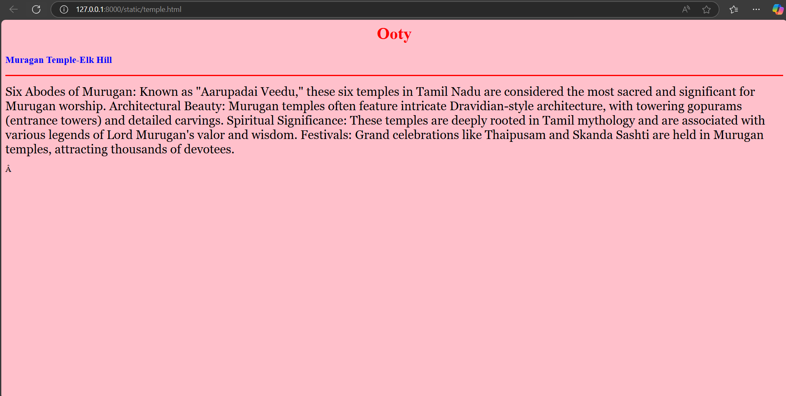
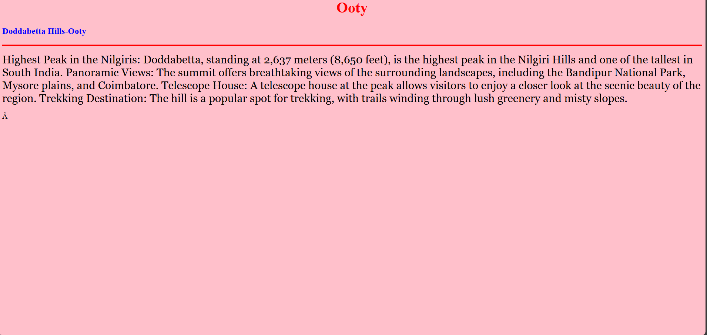

# Ex04 Places Around Me
## Date: 

## AIM
To develop a website to display details about the places around my house.

## DESIGN STEPS

### STEP 1
Create a Django admin interface.

### STEP 2
Download your city map from Google.

### STEP 3
Using ```<map>``` tag name the map.

### STEP 4
Create clickable regions in the image using ```<area>``` tag.

### STEP 5
Write HTML programs for all the regions identified.

### STEP 6
Execute the programs and publish them.

## CODE
```
Map.html

<html>
    <head>
        <title>My City</title>
    </head>
    <body>
        <h1 align="center">
            <font color="red"><b>OOTY</b></font>
        </h1>
        <h3 align="center">
            <font color="blue"><b>HARIHARASUDHAN N (212224040102)</b></font>
        </h3>
        <center>
            

            <map name="image-map">
                <area target="_blank" alt="OOTY" title="OOTY" href="ooty.html" coords="740,252,932,329" shape="rect">
                <area target="_blank" alt="METTUPALAYAM" title="METTUPALAYAM" href="mettupalayam.html" coords="886,402,1056,452" shape="rect">
                <area target="_blank" alt="TEA ESTATE" title="TEA ESTATE" href="tea.html" coords="667,703,834,802" shape="rect">
                <area target="_blank" alt="TEMPLE" title="TEMPLE" href="temple.html" coords="1136,491,1316,566" shape="rect">
                <area target="_blank" alt="Doddabetta" title="Doddabetta" href="doddabetta.html" coords="1601,452,1746,533" shape="rect">
                <area target="_blank" alt="GARDEN" title="GARDEN" href="garden.html" coords="1133,67,1262,156" shape="rect">
            </map>
        </center>
    </body>
</html>

```
```
Ooty.html

<html>
    <head>
        <title>My Favourite Town</title>
    </head>
    <body bgcolor="pink">
        <h1 align="center">
            <font color="red"><b>Ooty</b></font>
        </h1>
        <h3 allign="center">
            <font color="blue"><b>OOTY-Tourist place</b></font>
        </h3>
        <hr size="3" color="red">
        <p align="jusstify">
            <font face="Georgia" size="5">
                Picturesque Landscapes: Ooty, located in the Nilgiri Hills, is renowned for its beautiful tea plantations, rolling hills, and lush greenery.

                Ooty Lake: A serene spot for boating and enjoying the tranquil surroundings.
                
                Nilgiri Mountain Railway: The toy train ride offers breathtaking views and is a UNESCO World Heritage Site.
                
                Botanical Gardens: Famous for its wide variety of plants and the fossil tree trunk that is millions of years old.
                
                Doddabetta Peak: The highest peak in the Nilgiris, offering stunning views of the surrounding hills.   
            </font>
        </p>
    </body>
</html>
```
```
met.html
<html>
    <head>
        <title>My Favourite Town</title>
    </head>
    <body bgcolor="pink">
        <h1 align="center">
            <font color="red"><b>Ooty</b></font>
        </h1>
        <h3 allign="center">
            <font color="blue"><b>METTUPALAYAM-Tourist place</b></font>
        </h3>
        <hr size="3" color="red">
        <p align="jusstify">
            <font face="Georgia" size="5">
                Gateway to the Nilgiris: Mettupalayam serves as the starting point for the famous Nilgiri Mountain Railway, a UNESCO World Heritage Site.

                Pillur Dam: A serene spot surrounded by lush hills, perfect for relaxation and coracle rides.
                
                Vanabathrakali Amman Temple: An ancient temple steeped in mythology, dedicated to Goddess Badrakaali Amman.
                
                Nilgiri Mountain Rail Museum: Offers a glimpse into the history of the iconic toy train, showcasing old photographs and artifacts.
                
                Othimalai Murugan Temple: A beautiful 1,800-year-old temple with rich cultural significance.   
            </font>
        </p>
    </body>
</html>

```
```
tea.html
<html>
    <head>
        <title>My Favourite Town</title>
    </head>
    <body bgcolor="pink">
        <h1 align="center">
            <font color="red"><b>Ooty</b></font>
        </h1>
        <h3 allign="center">
            <font color="blue"><b>Tea Estate-Ooty</b></font>
        </h3>
        <hr size="3" color="red">
        <p align="jusstify">
            <font face="Georgia" size="5">
                Scenic Beauty: Tea estates are often located in picturesque regions like Darjeeling, Assam, and Munnar, surrounded by rolling hills and lush greenery.

                Tea Cultivation: These estates are dedicated to growing tea plants, with varieties like Assam, Darjeeling, and Nilgiri teas being globally renowned.
                
                Tea Processing: Many estates offer guided tours where visitors can learn about the tea-making process, from plucking leaves to drying and packaging.
                
                Tourism: Tea estates often serve as tourist destinations, offering activities like tea tasting, factory visits, and nature walks.
                
                Cultural Significance: Tea estates are deeply rooted in local traditions and history, often reflecting the heritage of the region.  
            </font>
        </p>
    </body>
</html>

```
```
temple.html
<html>
    <head>
        <title>My Favourite Town</title>
    </head>
    <body bgcolor="pink">
        <h1 align="center">
            <font color="red"><b>Ooty</b></font>
        </h1>
        <h3 allign="center">
            <font color="blue"><b>Muragan Temple-Elk Hill</b></font>
        </h3>
        <hr size="3" color="red">
        <p align="jusstify">
            <font face="Georgia" size="5">
                Six Abodes of Murugan: Known as "Aarupadai Veedu," these six temples in Tamil Nadu are considered the most sacred and significant for Murugan worship.

                Architectural Beauty: Murugan temples often feature intricate Dravidian-style architecture, with towering gopurams (entrance towers) and detailed carvings.
                
                Spiritual Significance: These temples are deeply rooted in Tamil mythology and are associated with various legends of Lord Murugan's valor and wisdom.
                
                Festivals: Grand celebrations like Thaipusam and Skanda Sashti are held in Murugan temples, attracting thousands of devotees.  
            </font>
        </p>
    </body>
</html>

```
```
doddabetta.html
<html>
    <head>
        <title>My Favourite Town</title>
    </head>
    <body bgcolor="pink">
        <h1 align="center">
            <font color="red"><b>Ooty</b></font>
        </h1>
        <h3 allign="center">
            <font color="blue"><b>Doddabetta Hills-Ooty</b></font>
        </h3>
        <hr size="3" color="red">
        <p align="jusstify">
            <font face="Georgia" size="5">
                Highest Peak in the Nilgiris: Doddabetta, standing at 2,637 meters (8,650 feet), is the highest peak in the Nilgiri Hills and one of the tallest in South India.

                Panoramic Views: The summit offers breathtaking views of the surrounding landscapes, including the Bandipur National Park, Mysore plains, and Coimbatore.
                
                Telescope House: A telescope house at the peak allows visitors to enjoy a closer look at the scenic beauty of the region.
                
                Trekking Destination: The hill is a popular spot for trekking, with trails winding through lush greenery and misty slopes.   
            </font>
        </p>
    </body>
</html>

```


## OUTPUT







## RESULT
The program for implementing image maps using HTML is executed successfully.
